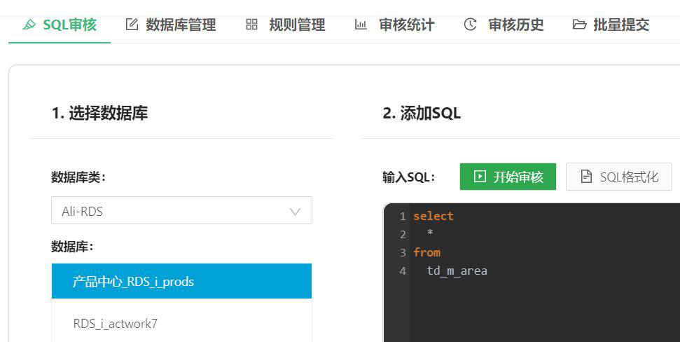
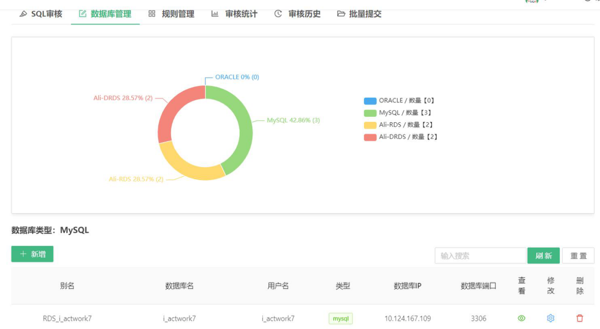
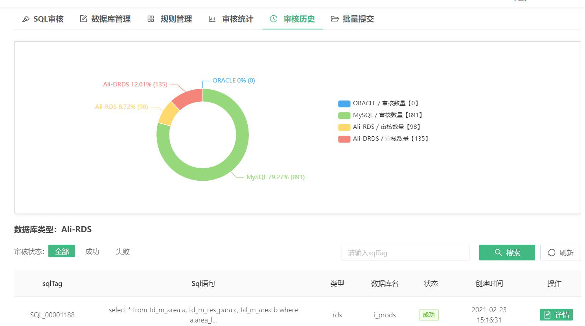
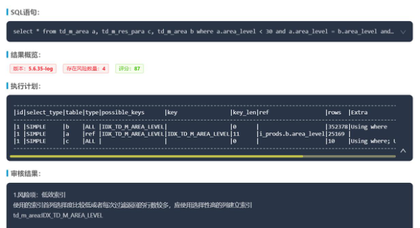

# 快速开始

## SQL审核

1. 开始审核前需选择相应类型的数据库连接
2. 添加SQL中，输入待审核SQL，可使用“SQL格式化”对文本进行格式化展示，点击“开始审核”后开始进行审核
3. 审核完成后，页面下方即展示SQL审核评分、执行计划、以及审核结果

* 点击“建表语句”查看SQL内涉及表的create table语句

* 单击“索引信息”查看SQL内涉及表的索引信息

## 数据库管理

数据库管理模块中，支持数据库连接的配置、修改、删除操作。用户需自行创建数据库连接，同时可看到数据库连接信息，已配的数据库类型数据统计视图。

## 历史审核统计分析

系统自动保留已审核完成的SQL信息，再此，您可查看到不同类型数据库已审核SQL。

